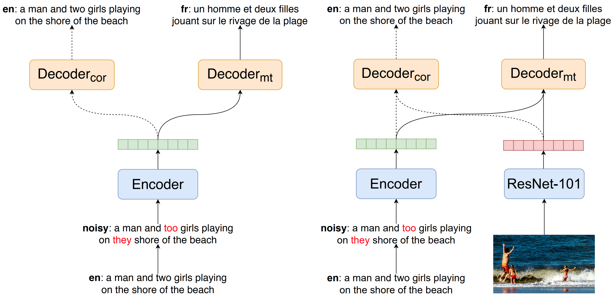

# Visual Cues and Error Correction for Translation Robustness
This repository includes codes, configurations and scripts for paper "[Visual Cues and Error Correction for Translation Robustness](https://aclanthology.org/2021.findings-emnlp.271.pdf)" in Findings of the Association for Computational Linguistics: EMNLP 2021.


## Notes
Codes for this repo are mainly based on the [nmtpytorch](https://github.com/lium-lst/nmtpytorch) and [pysimt](https://github.com/ImperialNLP/sim-mt) libraries, with minor changes (the error correction training module) added.

## Installation
The original textual data is located in `data/00-tok`. The BUTD features of Multi30k dataset can be collected using the [scripts](https://github.com/ImperialNLP/pysimt/tree/master/data/multi30k) from pysimt.

```
pip install -r requirements.txt
pip install --editable nmtpytorch
pip install --editable pysimt
```

You may need to run `pysimt-install-extra` to use METEOR for evaluation.

## Citation
```
@inproceedings{li-etal-2021-visual-cues,
    title = "Visual Cues and Error Correction for Translation Robustness",
    author = "Li, Zhenhao  and
      Rei, Marek  and
      Specia, Lucia",
    booktitle = "Findings of the Association for Computational Linguistics: EMNLP 2021",
    month = nov,
    year = "2021",
    address = "Punta Cana, Dominican Republic",
    publisher = "Association for Computational Linguistics",
    url = "https://aclanthology.org/2021.findings-emnlp.271",
    pages = "3153--3168",
}

@inproceedings{caglayan-etal-2020-simultaneous,
    title = "Simultaneous Machine Translation with Visual Context",
    author = {Caglayan, Ozan  and
      Ive, Julia  and
      Haralampieva, Veneta  and
      Madhyastha, Pranava  and
      Barrault, Lo{\"\i}c  and
      Specia, Lucia},
    booktitle = "Proceedings of the 2020 Conference on Empirical Methods in Natural Language Processing (EMNLP)",
    month = nov,
    year = "2020",
    address = "Online",
    publisher = "Association for Computational Linguistics",
    url = "https://www.aclweb.org/anthology/2020.emnlp-main.184",
    pages = "2350--2361",
}

@article{nmtpy2017,
  author    = {Ozan Caglayan and
               Mercedes Garc\'{i}a-Mart\'{i}nez and
               Adrien Bardet and
               Walid Aransa and
               Fethi Bougares and
               Lo\"{i}c Barrault},
  title     = {NMTPY: A Flexible Toolkit for Advanced Neural Machine Translation Systems},
  journal   = {Prague Bull. Math. Linguistics},
  volume    = {109},
  pages     = {15--28},
  year      = {2017},
  url       = {https://ufal.mff.cuni.cz/pbml/109/art-caglayan-et-al.pdf},
  doi       = {10.1515/pralin-2017-0035},
  timestamp = {Tue, 12 Sep 2017 10:01:08 +0100}
}
```